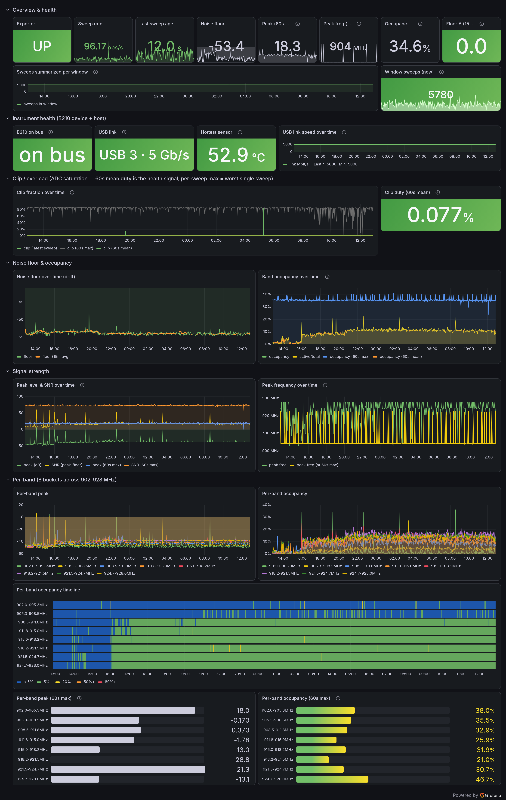

# sdr-tools

A collection of small, self-contained software-defined-radio / RF tools from my
own homelab. Each tool lives in its own subdirectory — its own README, its own
dependencies, independently runnable and (where it's a Python package)
independently `pip`-installable. New tools get added as their own subdir; there
is no shared runtime to buy into.

Where a tool produces metrics it ships the whole observability path with it: a
**Prometheus exporter**, an example scrape job + systemd unit, and an importable
**Grafana dashboard** — nothing external to wire up.



*Above: `sdr-sweep`'s Grafana dashboard — noise-floor drift, per-band occupancy,
ADC-clip health, and B210 instrument telemetry, all fed by `sdr-sweep-exporter`.*

## Tools

| Tool | What it does | Hardware |
|---|---|---|
| [**sdr-sweep**](./sdr-sweep) | Wideband spectrum sweep, live terminal waterfall, offline drift/occupancy report, Prometheus exporter, and Grafana dashboard. Five commands around one shared log/stream format. | USRP B210 (UHD) for capture; analysis/exporter/TUI run anywhere |

## Installing a tool

The Python tools here are packaged per-subdir, so `pip`/`pipx` install them with
a `#subdirectory=` fragment on the repo URL — the package name and its console
scripts are unchanged:

```sh
pipx install "git+https://github.com/seitzbg/sdr-tools.git#subdirectory=sdr-sweep"
```

See each tool's own README for its full install steps, system dependencies, and
usage. (`sdr-sweep`, for example, needs a system UHD install for the two capture
commands — that's not a PyPI dependency.)

## Author

Developed by **Bryan Seitz**, with assistance from AI.

## License

[MIT](LICENSE) © 2026 Bryan Seitz.
